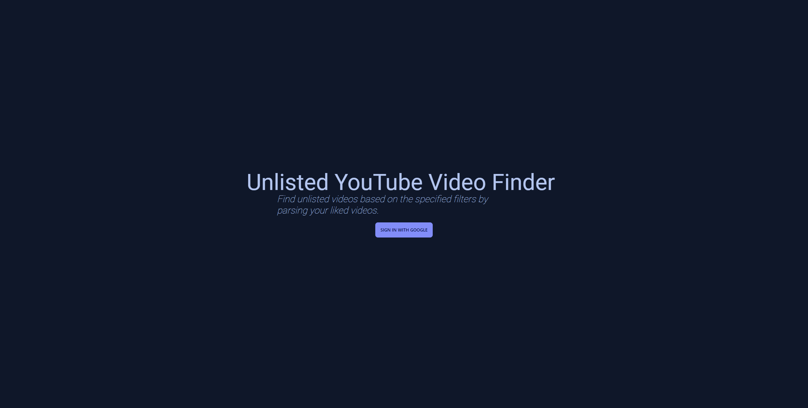

# Description

This website helps you find unlisted YouTube videos with relative ease. Currently, it is limited to unlisted videos that is found within your liked videos playlist on YouTube. The intent is to help make crowd-sourcing unlisted videos so that you can easily spot unlisted videos and share the information.

# How To Use

1. Sign in with Google/YouTube to provide access to your liked videos
2. Hit *Get Liked Videos* to start fetching your liked videos

After fetching the videos, you can filter for videos based on channel or video name. In the future users will be able to filter by video visibility and videos they select, and a method to easily share the selected videos with others.

# Implementation — How It Works

### Authentication

Users authenticate with their Google/YouTube account so that the website can fetch the necessary data from the user.

### Fetching The Data

After authenticated, calls are made to YouTube's Data API to fetch the user's liked videos. The provided data includes but is not limited to the video's name, channel owner, thumbnail, and visiblity, all of which is used by the website.

### Data & Privacy

First and foremost everything is done via your browser. I don't make calls to my own server or API. The API that is called is Google's YouTube Data API using the user's provided authentication. I provided a basic [privacy policy](./PRIVACY_POLICY.md) that I thought was appropriate enough.

Again, I don't collect and store your data, so I suppose there really isn't a need for one if you ask me. Nonetheless the [privacy policy](./PRIVACY_POLICY.md) is there should you want to give it a read. There really isn't much to say. All the code is public in this repository for you to view.

# Locally Running & Building

This project was bootstrapped with [Create React App](https://github.com/facebook/create-react-app).

## Requirements

Following the template provided in [.env.example](./.env.example), please create a new file named `.env` within the root directory and supply at least the environment variable `REACT_APP_GOOGLE_OAUTH_CLIENT_ID`. The value is the Client ID provided by Google for OAuth 2.0 access when you create the credentials. Please follow their instructions to create it. Make sure you also enable the YouTube Data API and to add `/auth/youtube.readonly` to the list of scopes for the YouTube Data API to ensure everything works.

## Available Scripts

In the project directory, you can run:

### `npm install`

Installs the required packages

### `npm start`

Runs the app in the development mode.\
Open [http://localhost:3000](http://localhost:3000) to view it in the browser.

The page will reload if you make edits.\
You will also see any lint errors in the console.

### `npm test`

Launches the test runner in the interactive watch mode.\
See the section about [running tests](https://facebook.github.io/create-react-app/docs/running-tests) for more information.

### `npm run build`

Builds the app for production to the `build` folder.\
It correctly bundles React in production mode and optimizes the build for the best performance.

The build is minified and the filenames include the hashes.\
Your app is ready to be deployed!

See the section about [deployment](https://facebook.github.io/create-react-app/docs/deployment) for more information.

## Learn More

You can learn more in the [Create React App documentation](https://facebook.github.io/create-react-app/docs/getting-started).

To learn React, check out the [React documentation](https://reactjs.org/).
